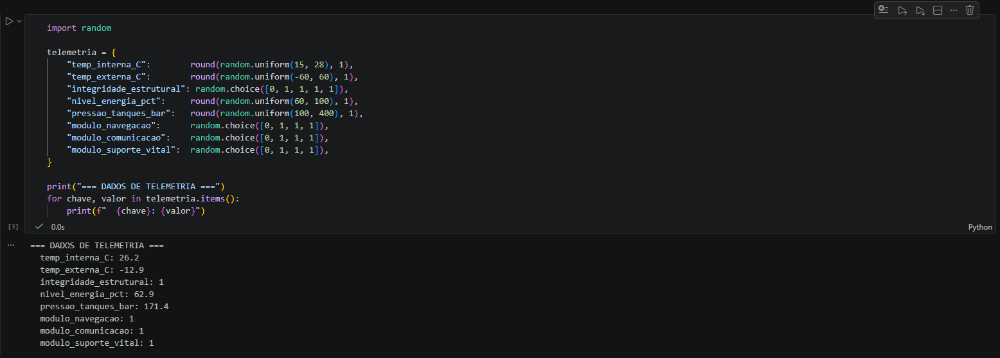
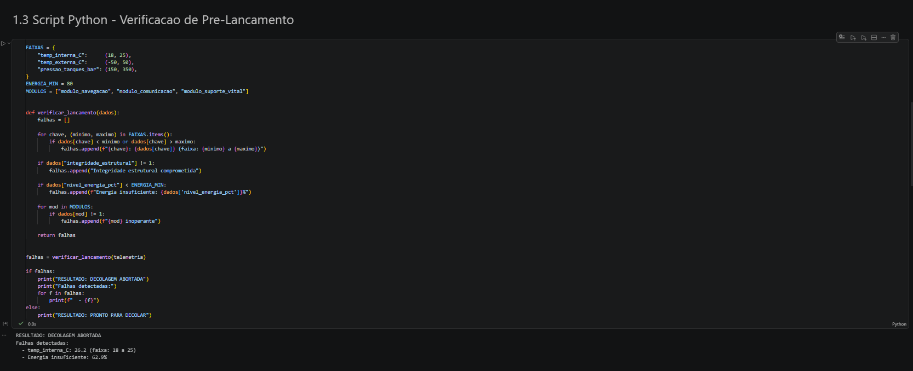
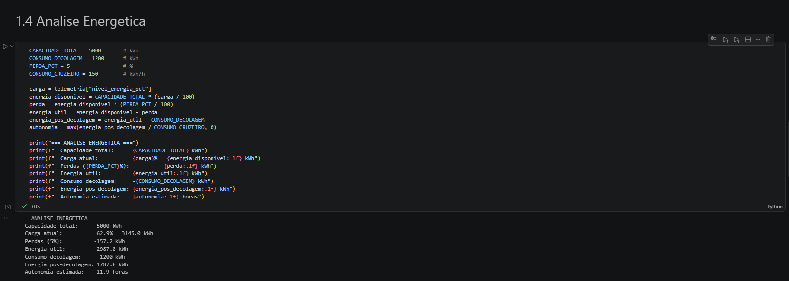
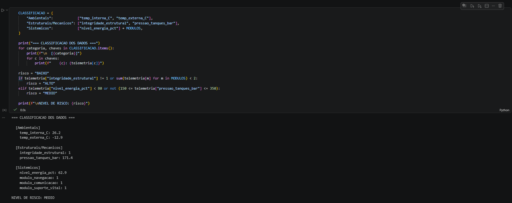

# Projeto Aurora - Atividade Integradora FIAP

Simulacao de telemetria de pre-lancamento espacial com verificacao automatizada de condicoes de decolagem.

## Sobre o Projeto

O notebook simula sensores de uma nave espacial e decide automaticamente se a nave esta PRONTA PARA DECOLAR ou se a DECOLAGEM DEVE SER ABORTADA com base em faixas seguras predefinidas.

### Secoes do Notebook

| Secao | Conteudo |
|---|---|
| 1.1 | Organizacao e descricao dos dados de telemetria |
| 1.2 | Algoritmo de verificacao (pseudocodigo) |
| 1.3 | Script Python com leitura, verificacao e resultado |
| 1.4 | Analise energetica (autonomia, consumo, perdas) |
| 1.5 | Analise assistida por IA (classificacao, anomalias, riscos) |
| 1.6 | Reflexao critica (etica, impacto social, sustentabilidade) |

## Instrucoes de Execucao

### Pre-requisitos

- Python 3.10+
- Jupyter Notebook ou VS Code com extensao Jupyter

### Passos

```bash
# Clone o repositorio
git clone https://github.com/Julio-vincente/fiapAurora.git
cd fiapAurora

# Crie e ative o ambiente virtual
python3 -m venv .venv
source .venv/bin/activate

# Instale o Jupyter
pip install jupyter

# Execute o notebook
jupyter notebook projeto_aurora.ipynb
```

## Prints da Execucao

### Dados de Telemetria


### Resultado da Verificacao


### Analise Energetica


### Classificacao e Risco


## Autor

- Julio - RM 570945
